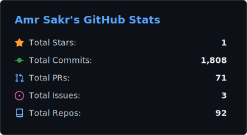
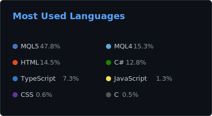

<h1 align="center">Hi there 👋, I'm Amr Sakr</h1>

I turn trading ideas into working code. Over a decade of building algorithmic trading systems, MetaTrader Expert Advisors, and fintech platforms using .NET/C#, MQL4/MQL5, and Pine Script.  
<em>If it trades, I've probably built the EA for it.</em>  
🏆 180+ projects on Freelancer.com · Top Rated on Upwork 
📍 Alexandria, Egypt · <a href="https://amrsakr.com">amrsakr.com</a>

